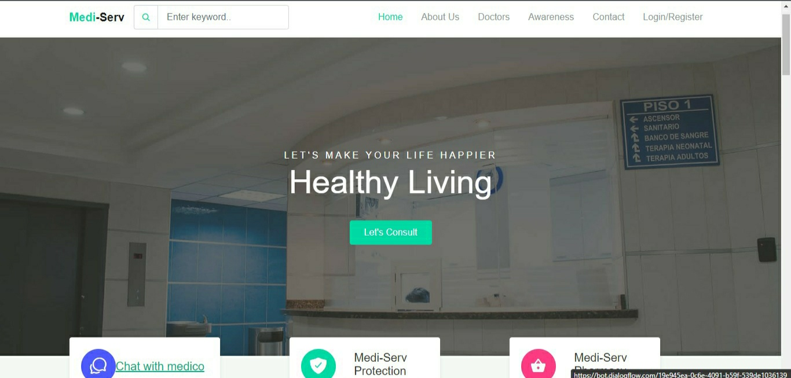
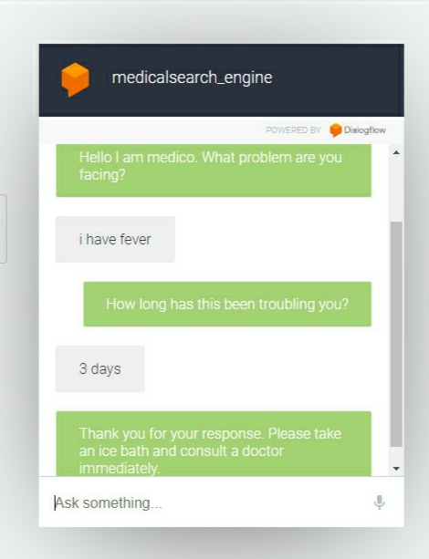
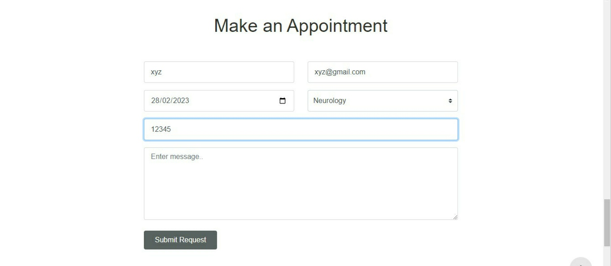
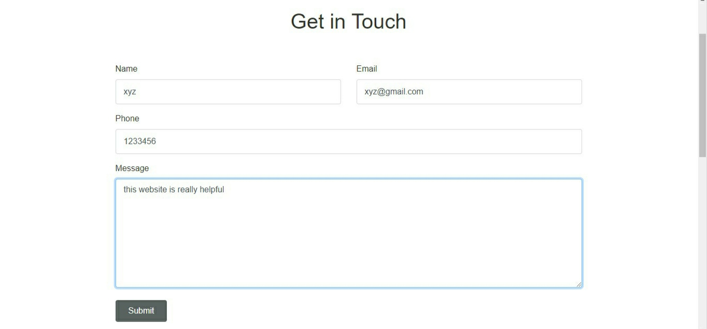

# Smart Interface for Medical Diagnosis

This project's goal is to concentrate on the idea of a text-to-text diagnosis interface that converses with patients about their medical problems and offers a tailored diagnosis based on their symptoms. People will therefore be aware of their health and be properly protected.

## Features

- Logs and Authentication
- Chatting or Conversation with the search engine
- Searching or querying medical information
- Feedback and Administrative system

## Tech Stack

**FRONTEND:** HTML,CSS,JAVASCRIPT,BOOTSTRAP,JQUERY

**BACKEND:**  FIREBASE

GOOGLE DAILOGE FLOW

## Screenshots
<h3>Home page</h3>

 
<h3>sign up and sign in </h3>

 
<h3>mediserve (medical search engine) </h3>

 
<h3>appointment booking</h3>

 
<h3>Feedback</h3>

